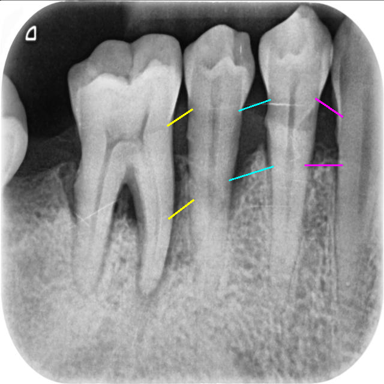

# Auxiliary Evaluation of Marginal Ridge Discrepancy in Periodontal Disease Using Deep Learning on Periapical Radiographs

<p align="center">
  
</p>

## Abstract
Marginal Ridge Discrepancy (MRD) is an important early indicator of periodontal disease, often resulting from tooth inclination or alveolar bone loss, leading to uneven interproximal ridge height. Although periapical radiographs commonly observe bone and root structures, image overlap and angle variation often hinder accurate clinical interpretation. This study proposes a deep learning-based system integrating image segmentation and angular evaluation to assist dentists in objectively classifying MRD severity and improving diagnostic efficiency. 

## Methods
We adopted a Mask R-CNN model with ResNet-101 as the backbone, incorporating warm-up and learning rate scheduling strategies to ensure stable convergence. Moreover, Mask R-CNN localized the cemento-enamel junction and alveolar crest by overlapping the mask image. We also introduced a novel angular measurement method to quantify the MRD between adjacent ridges and categorize periodontal disease severity. 

## Hyperparameter
| Iteration | 1000 | Batch Size Per Image |	256 | 
|:------------------:|:----:|:------------------:|:---:|
| Batch | 4 | Optimizer | Adam |
| Worker | 2 | Number of Classes | 4 |
| Warm-up Iteration | 200 | Base Learning Rate | 0.0025 |
| Warm-up Factor | 1/1000 | Learning Rate Scheduler | CosineAnnealing |

## Model Results
### Classification
| Metrices | Accuracy | Specificity | Sensitivity | Precision | F1-score | R2    | Cohen’s κ | 95%-CI              |
|:--------:|:--------:|:-----------:|:-----------:|:---------:|:--------:|:-----:|:---------:|:------------------:|
| Average  | 0.9441   | 0.9473      | 0.9441      | 0.9337    | 0.9333   | 0.9532| 0.9109    | [0.9339,0.9472]    |
| Class 0  | 0.9512   | 0.9736      | 0.9518      | 0.9564    | 0.9724   | 0.9271| 0.9135    | [0.9400,0.9688]    |
| Class 1  | 0.9585   | 0.9850      | 0.9487      | 0.9354    | 0.9063   | 0.9327| 0.9114    | [0.9527,0.9674]    |
| Class 2  | 0.9018   | 0.9269      | 0.9186      | 0.9142    | 0.8889   | 0.9112| 0.9006    | [0.8913,0.9269]    |
| Class 3  | 0.9329   | 0.9756      | 0.9545      | 0.9333    | 0.9438   | 0.9457| 0.0901    | [0.9294,0.9501]    |

### Comparison of Segmentation Performance Across Datasets

`This Study`
| Metric        | Tooth   | Crown   | Bone    |
|:-------------:|:-------:|:-------:|:-------:|
| DSC           | 0.9542  | 0.9323  | 0.9589  |
| Jaccard Index | 0.9203  | 0.8838  | 0.9063  |
| Accuracy      | 0.9635  | 0.9863  | 0.9856  |
| Precision     | 0.9488  | 0.9153  | 0.9823  |
| Sensitivity   | 0.9718  | 0.9792  | 0.9775  |
| IoU           | 0.9673  | 0.9467  | 0.9566  |
| Accuracy (mean ± SD) | 0.9635 ± 0.0006 | 0.9863 ± 0.0034 | 0.9856 ± 0.0025 |
| Accuracy (p-value)   | 0.0124  | 0.0131  | 0.0164  |
| Accuracy (95% CI)    | [0.9631, 0.9639] | [0.9842, 0.9873] | [0.9831, 0.9884] |

`Mendeley Dataset (Thalji et al., 2024)`
| Metric        | Tooth   | Crown   | Bone    |
|:-------------:|:-------:|:-------:|:-------:|
| DSC           | 0.9594  | 0.9497  | 0.9384  |
| Jaccard Index | 0.9143  | 0.8784  | 0.8997  |
| Accuracy      | 0.9593  | 0.9834  | 0.9839  |
| Precision     | 0.9375  | 0.9362  | 0.9765  |
| Sensitivity   | 0.9421  | 0.9676  | 0.9746  |
| IoU           | 0.9684  | 0.9462  | 0.9606  |
| Accuracy (mean ± SD) | 0.9593 ± 0.0005 | 0.9834 ± 0.0028 | 0.9839 ± 0.0026 |
| Accuracy (p-value)   | 0.0157  | 0.0119  | 0.0143  |
| Accuracy (95% CI)    | [0.9590, 0.9611] | [0.9806, 0.9647] | [0.9827, 0.9649] |

`Periapical X-rays Dataset (Sajad, 2021)`
| Metric        | Tooth   | Crown   | Bone    |
|:-------------:|:-------:|:-------:|:-------:|
| DSC           | 0.9610  | 0.9531  | 0.9367  |
| Jaccard Index | 0.9237  | 0.8946  | 0.8863  |
| Accuracy      | 0.9642  | 0.9866  | 0.9678  |
| Precision     | 0.9478  | 0.9407  | 0.9755  |
| Sensitivity   | 0.9511  | 0.9538  | 0.9761  |
| IoU           | 0.9698  | 0.9524  | 0.9582  |
| Accuracy (mean ± SD) | 0.9642 ± 0.0003 | 0.9866 ± 0.0021 | 0.9678 ± 0.0030 |
| Accuracy (p-value)   | 0.0134  | 0.0148  | 0.161   |
| Accuracy (95% CI)    | [0.9633, 0.9658] | [0.9853, 0.9876] | [0.9659, 0.9683] |


## Directory Structure
* [DeepLabV3](https://github.com/howard-liang-B/MRD/tree/main/DeepLabV3_PyTorch), [SegFormer](https://github.com/howard-liang-B/MRD/tree/main/SegFormer): This section provides training model examples, with only three models included as representative samples.
* [CEJ_ALC](https://github.com/howard-liang-B/MRD/tree/main/CEJ_ALC): CEJ and ALC are anatomical landmarks on periapical X-rays, marking the cemento-enamel junction and alveolar crest.

## Citation
```
@article{
      lin2025marginalridge,
      title={Auxiliary Evaluation of Marginal Ridge Discrepancy in Periodontal Disease Using Deep Learning on Periapical Radiographs},
      author={Yuan-Jin Lin, Yi-Cheng Mao, Tai-Jung Lin, Chin-Hao Liang, Shih-Lun Chen, Tsung-Yi Chen, Chiung-An Chen, Kuo-Chen Li, Wei-Chen Tu and Patricia Angela R. Abu 9},
      journal={Machine Learning with Applications},
      year={2025},
      doi={[doi]}
}
```
